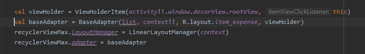
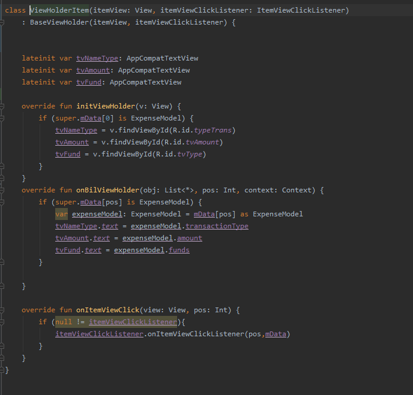

# BaseApplication
tạo thư viện base app

Step 1: Add it in your root build.gradle: (Project) at the end of repositories
------------
maven { url 'https://jitpack.io' }

}

Step 2: Add the dependency in build.gradle (Module:app) 
------------

implementation 'com.github.duong-nk:BaseApplication:Tag'

BaseAdapter
-----------
val viewHolder = ViewHolder(activity!!.window.decorView.rootView, this)

BaseAdapter baseAdapter =BaseAdapter(MyList, context, R.layout.item_expense, viewHolder)

ViewHolder
----------

Introduction
-----------

}

